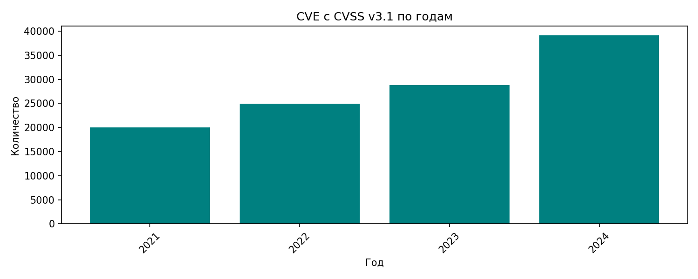
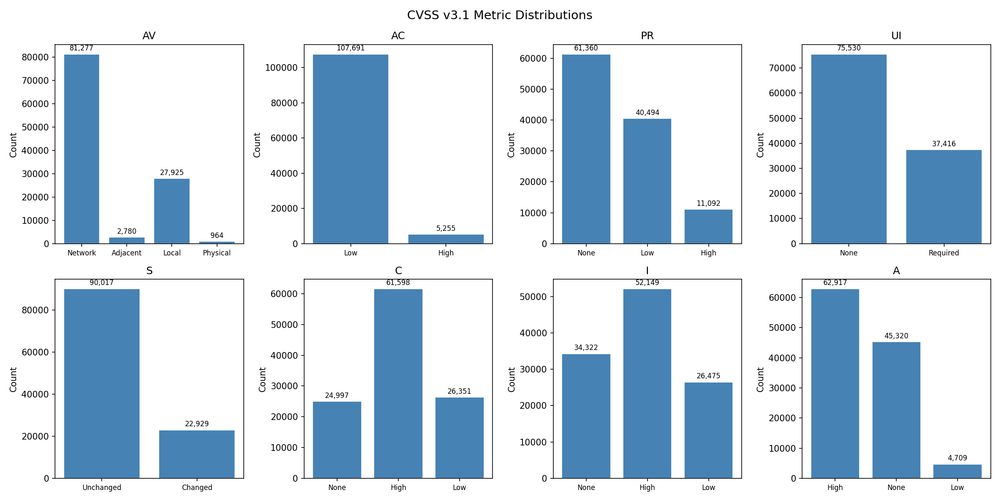
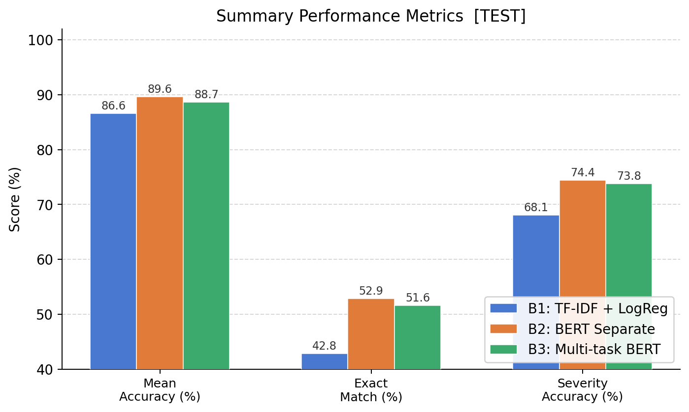
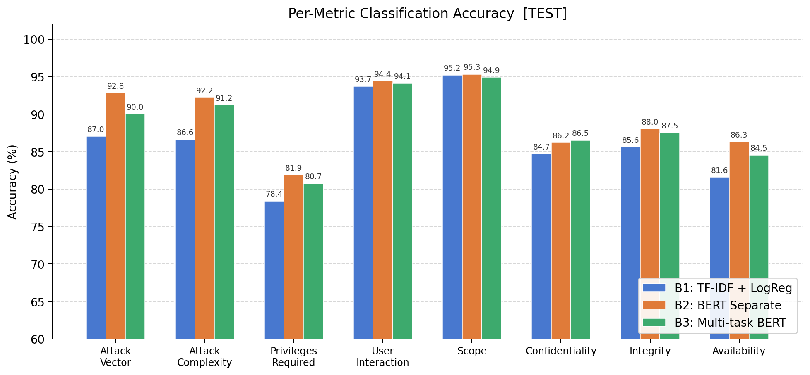
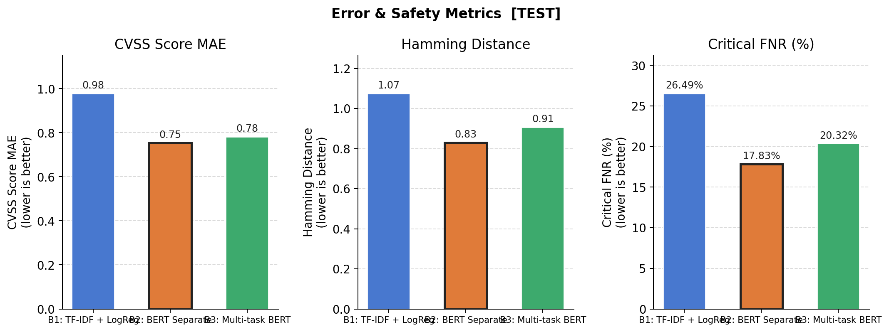

# CWE_CWSS 
Автоматическая оценка уязвимостей по стандарту CVSS v3.1 методами NLP


---

## Аннотация

В данной работе исследуется возможность автоматического предсказания всех восьми метрик системы оценки 
уязвимостей CVSS v3.1 по тексту описания CVE. Для достижения этой цели был сформирован датасет из 
**112 946** записей на основе данных NIST NVD API v2.0, охватывающих период с 2021 по 2024 год. 
Предложены и сравниваются четыре базовые архитектуры: TF-IDF + Logistic Regression, DistilBERT с
независимыми классификаторами, мультизадачный DistilBERT и мультимодальная модель на основе DistilBERT + 
CodeBERT. Лучшая модель (B2) достигает **89.6% средней точности** и **52.9% Exact Match** на тестовой выборке.
Показано, что применение BERT снижает долю пропущенных критических уязвимостей (Critical FNR) с 
**26.5% до 17.8%**.


[//]: # (## Содержание)

[//]: # ()
[//]: # (1. [Введение]&#40;#1-введение&#41;)

[//]: # (2. [Обзор литературы]&#40;#2-обзор-литературы&#41;)

[//]: # (3. [Постановка задачи]&#40;#3-постановка-задачи&#41;)

[//]: # (4. [Набор данных]&#40;#4-набор-данных&#41;)

[//]: # (5. [Методы]&#40;#5-методы&#41;)

[//]: # (6. [Эксперименты и результаты]&#40;#6-эксперименты-и-результаты&#41;)

[//]: # (7. [Анализ ошибок]&#40;#7-анализ-ошибок&#41;)

[//]: # (8. [Обсуждение]&#40;#8-обсуждение&#41;)

[//]: # (9. [Заключение]&#40;#9-заключение&#41;)

[//]: # (10. [Направления дальнейших исследований]&#40;#10-направления-дальнейших-исследований&#41;)

[//]: # (11. [Структура репозитория]&#40;#11-структура-репозитория&#41;)

[//]: # (12. [Воспроизведение результатов]&#40;#12-воспроизведение-результатов&#41;)

[//]: # (13. [Список литературы]&#40;#13-список-литературы&#41;)

---

## 1. Введение

### 1.1 Актуальность

Своевременная и точная оценка уязвимостей является критическим звеном в цикле реагирования на угрозы 
информационной безопасности. Стандарт CVSS v3.1 (Common Vulnerability Scoring System), 
разработанный организацией FIRST, предоставляет унифицированную систему количественной оценки по восьми 
независимым метрикам: Attack Vector (AV), Attack Complexity (AC), Privileges Required (PR), User Interaction 
(UI), Scope (S), Confidentiality Impact (C), Integrity Impact (I) и Availability Impact (A). Итоговый базовый
балл в диапазоне 0.0–10.0 определяет приоритет реагирования.

Однако назначение CVSS-оценок по-прежнему осуществляется вручную специалистами по безопасности. На одну CVE 
уходит от 30 до 60 минут. При этом число публикуемых уязвимостей стремительно растёт: в 2023 году в базе NIST 
NVD зафиксировано более 29 000 новых CVE — исторический рекорд.

Автоматизация первичной оценки CVSS способна снизить нагрузку на аналитиков SOC, ускорить триаж уязвимостей, 
повысить согласованность оценок и сократить вероятность пропуска критичных уязвимостей.

### 1.2 Цели и задачи работы

**Цель:** исследовать применимость методов NLP для автоматического предсказания всех восьми метрик CVSS 
v3.1 по тексту описания CVE.

**Задачи:**
1. Собрать и описать датасет реальных CVE с разметкой CVSS v3.1.
2. Реализовать и обучить четыре базовые модели с нарастающей сложностью архитектуры.
3. Провести сравнительный анализ по набору стандартных и предметно-ориентированных метрик.
4. Выявить «сложные» метрики и источники ошибок.
5. Предложить мультизадачный и мультимодальный подходы как авторский вклад.

---

## 2. Обзор литературы

Проблема автоматической оценки CVSS привлекает внимание исследователей с середины 2010-х годов, однако остаётся
недостаточно изученной.

**Ранние подходы (до 2020 г.)** использовали TF-IDF в сочетании с SVM, Naive Bayes или Random Forest для 
предсказания одной-двух метрик (чаще всего Attack Vector и базового балла). Основное ограничение — работа с 
каждой метрикой независимо, без учёта взаимозависимости метрик.

**Shahid et al. (2021)** предложили BERT-based классификатор для предсказания базового балла и категории 
severity. Авторы не предсказывали отдельные метрики вектора, что не позволяет интерпретировать результат и 
верифицировать его через официальную формулу CVSS.

**Costa et al. (2022)** применили RoBERTa для классификации по нескольким метрикам CVSS v3.x, однако 
рассматривали задачи независимо и не оценивали Exact Match всего вектора.

**Aghaei et al. (2023)** исследовали обогащение описаний CVE дополнительным контекстом (CWE-теги), показав 
прирост 1–3 пп над plain text. Мультизадачное обучение в работе не рассматривалось.

**Место настоящей работы:** в отличие от перечисленных исследований, предлагается одновременное предсказание 
**всех восьми метрик** одной моделью (B3) с мультизадачным обучением и взвешенной функцией потерь, а также 
применение **кода патча** как дополнительного сигнала (B4). В качестве основного критерия качества 
вводится **Exact Match вектора**.

---

## 3. Постановка задачи

Пусть задан текст описания CVE — последовательность токенов $x = (x_1, x_2, \ldots, x_n)$. 
Требуется предсказать вектор меток:

$$\hat{y} = (\hat{y}_{AV},\ \hat{y}_{AC},\ \hat{y}_{PR},\ \hat{y}_{UI},\ \hat{y}_{S},\ \hat{y}_{C},\ \hat{y}_{I},\ \hat{y}_{A})$$

где каждая компонента принимает значение из соответствующего конечного множества классов:

| Метрика | Классы | Кол-во классов |
|---------|--------|:--------------:|
| AV — Attack Vector | N, A, L, P | 4 |
| AC — Attack Complexity | L, H | 2 |
| PR — Privileges Required | N, L, H | 3 |
| UI — User Interaction | N, R | 2 |
| S — Scope | U, C | 2 |
| C — Confidentiality Impact | N, L, H | 3 |
| I — Integrity Impact | N, L, H | 3 |
| A — Availability Impact | N, L, H | 3 |

Задача декомпозируется на **восемь связанных задач многоклассовой классификации**. Итоговая метрика качества 
— **Exact Match**: доля записей, для которых все восемь предсказанных меток совпадают с истинными одновременно.

---

## 4. Набор данных

### 4.1 Источник и сбор данных

Данные получены через **NIST NVD API v2.0** — официальный реестр CVE Национального института стандартов и 
технологий США. Для каждой записи извлекались:
- CVE-идентификатор;
- текстовое описание на английском языке;
- вектор CVSS v3.1 (строка формата `CVSS:3.1/AV:N/AC:L/...`);
- базовый балл и уровень критичности (NONE / LOW / MEDIUM / HIGH / CRITICAL);
- теги CWE (Common Weakness Enumeration);
- дата публикации.

Дополнительно для подмножества записей собирались **коды патчей** — unified diff изменений в коде из 
репозиториев GitHub/GitLab, упомянутых в ссылках CVE. 

(**место для продолжения работы**)

### 4.2 Временное распределение



Датасет охватывает уязвимости с 2021 по 2024 год. Ежегодный рост числа CVE объясняется 
расширением bug bounty программ и внедрением автоматизированных сканеров уязвимостей. Эта динамика подтверждает
актуальность задачи автоматизации.

### 4.3 Разбивка и статистика

| Выборка | Записей | Доля |
|---------|--------:|-----:|
| Обучающая (train) | 90 351 | 79.9% |
| Валидационная (val) | 11 287 | 10.0% |
| Тестовая (test) | 11 308 | 10.0% |
| **Итого** | **112 946** | **100%** |
| В том числе с патчами | 399 | 0.35% |

Разбивка выполнена по времени: обучающая выборка содержит более ранние CVE, тестовая — наиболее поздние. 
Это моделирует реальный сценарий эксплуатации системы.

### 4.4 Распределение меток и дисбаланс классов



Датасет характеризуется **существенным дисбалансом классов**, типичным для реальных данных NVD:

| Метрика | Доминирующий класс | Редкий класс | Коэффициент дисбаланса |
|---------|-------------------|--------------|:----------------------:|
| AV | N: 65 020 (72.0%) | P: 770 (0.85%) | **84:1** |
| AC | L: 86 093 (95.3%) | H: 4 258 (4.7%) | **20:1** |
| PR | N: 49 045 (54.3%) | H: 8 831 (9.8%) | 5.5:1 |
| UI | N: 60 510 (67.0%) | R: 29 841 (33.0%) | 2:1 |
| S  | U: 72 107 (79.8%) | C: 18 244 (20.2%) | 3.9:1 |
| C  | H: 49 205 (54.5%) | N: 20 112 (22.3%) | 2.4:1 |
| I  | H: 41 699 (46.1%) | L: 21 131 (23.4%) | 2:1 |
| A  | H: 50 375 (55.7%) | L: 3 771 (4.2%) | **13.4:1** |

Дисбаланс учитывался при обучении через взвешивание классов: `class_weight='balanced'` для Logistic Regression 
и `compute_class_weights` для BERT-моделей.

---

## 5. Методы

Реализованы три базовые модели. Код находится в директории `baselines/`. 

(**место для продолжения работы**)

### 5.1 B1: TF-IDF + Logistic Regression

Классическая baseline-модель. Для каждой из восьми метрик обучается **независимый** классификатор.

**Текстовые признаки:** TF-IDF со следующими параметрами:
- максимальное число признаков: 5 000;
- диапазон n-грамм: (1, 2) — уни- и биграммы;
- нижняя граница document frequency: 2.

**Классификатор:** Logistic Regression с `class_weight='balanced'`, `max_iter=1000`, `C=1.0`.

**Преимущества:** высокая скорость обучения и инференса, интерпретируемость через веса признаков.
**Ограничения:** не учитывает семантику и контекст; признаки фиксированы.

### 5.2 B2: DistilBERT с независимыми классификаторами

Восемь независимых файн-тюнингов предобученной модели **DistilBERT** (`distilbert-base-uncased`, 66 млн 
параметров, 6 слоёв трансформера, скрытое измерение 768).

Каждая модель: DistilBERT → `[CLS]`-токен → Linear(768, num\_classes) → Softmax.

**Гиперпараметры:** 4 эпохи, batch size 32, lr = 2·10⁻⁵, max\_length = 128 токенов, AdamW оптимизатор. 
Потеря — взвешенная кросс-энтропия с весами классов.

### 5.3 B3: Мультизадачный DistilBERT

**Авторский вклад.** Единая модель с общим кодировщиком и восемью параллельными головами классификации:

```
DistilBERT(x) → h[CLS] ∈ R^768 → {W_k · h[CLS]}_{k=1..8}
```

**Функция потерь** — взвешенная сумма задачно-специфичных кросс-энтропий:

$$\mathcal{L} = \sum_{k=1}^{8} \lambda_k \cdot \mathcal{L}_{CE}^{(k)}$$

Веса задач $\lambda_k$ выбраны на основе предварительного анализа сложности:

| Метрика | AV | AC | PR | UI | S | C | I | A |
|---------|:--:|:--:|:--:|:--:|:-:|:-:|:-:|:-:|
| $\lambda_k$ | 1.0 | 1.0 | **1.5** | 1.0 | 1.0 | **1.2** | **1.2** | **1.2** |

PR получает наибольший вес как наиболее сложная для предсказания метрика. Метрики C, I, A увеличены, 
поскольку ошибки в них наиболее критичны с точки зрения безопасности.

**Практическое преимущество:** один прямой проход при инференсе вместо восьми — ускорение в 8 раз при 
встраивании.

---

## 6. Эксперименты и результаты

### 6.1 Сводная таблица результатов (тестовая выборка)

| Модель | Средняя точность | Exact Match | Hamming ↓ | MAE балла ↓ | Точность severity | Critical FNR ↓ |
|--------|:----------------:|:-----------:|:---------:|:-----------:|:-----------------:|:--------------:|
| B1: TF-IDF + LR | 86.59% | 42.79% | 1.073 | 0.977 | 68.08% | 26.49% |
| B2: BERT раздельный | **89.62%** | **52.88%** | **0.830** | **0.753** | **74.42%** | **17.83%** |
| B3: Мультизадачный BERT | 88.68% | 51.64% | 0.906 | 0.781 | 73.75% | 20.32% |

 **Exact Match** — доля записей, для которых все восемь метрик предсказаны верно одновременно.
 **Critical FNR** — доля пропущенных уязвимостей с базовым баллом ≥ 7.0.
 Стрелка ↓ означает «чем меньше, тем лучше».



### 6.2 Точность по отдельным метрикам (тестовая выборка)

| Метрика | B1: TF-IDF | B2: BERT | B3: MT-BERT | Δ (B2 − B1) |
|---------|:----------:|:--------:|:-----------:|:-----------:|
| AV | 87.03% | **92.80%** | 90.00% | +5.77 пп |
| AC | 86.61% | **92.20%** | 91.20% | +5.59 пп |
| PR | 78.38% | **81.90%** | 80.70% | +3.52 пп |
| UI | 93.68% | **94.40%** | 94.10% | +0.72 пп |
| S  | 95.21% | **95.30%** | 94.90% | +0.09 пп |
| C  | 84.67% | 86.20% | **86.50%** | +1.53 пп |
| I  | 85.58% | **88.00%** | 87.50% | +2.42 пп |
| A  | 81.56% | **86.30%** | 84.50% | +4.74 пп |
| **Среднее** | **86.59%** | **89.62%** | **88.68%** | **+3.03 пп** |



**Наблюдение.** Метрики разделяются на две группы по сложности предсказания:
- **«Лёгкие»** (UI, S, AV, AC): точность > 90% у всех моделей — хорошо выражены в тексте описания.
- **«Сложные»** (PR, A, C, I): точность 78–88% — требуют понимания глубокого семантического контекста, 
 что мотивирует дальнейшее исследование мультимодального подхода.

### 6.3 Результаты на валидационной выборке

| Модель | Средняя точность | Exact Match | Hamming | MAE | Severity Acc. |
|--------|:----------------:|:-----------:|:-------:|:---:|:-------------:|
| B1 | 86.54% | 42.81% | 1.077 | 0.987 | 68.67% |
| B2 | **89.65%** | **53.08%** | **0.828** | **0.764** | **75.25%** |
| B3 | 88.81% | 51.31% | 0.895 | 0.780 | 73.90% |

Результаты на val и test хорошо согласуются, что свидетельствует об отсутствии переобучения.

---

## 7. Анализ ошибок



### 7.1 Critical FNR — ключевая метрика безопасности

**Critical FNR** (False Negative Rate для уязвимостей с базовым баллом ≥ 7.0) является наиболее практически 
значимой метрикой: пропущенная критическая уязвимость не попадает в план патчинга, что напрямую повышает 
риск инцидента.

| Модель | Critical FNR |  Снижение отн. B1   |
|--------|:-----------:|:-------------------:|
| B1 | 26.49% |          —          |
| B3 | 20.32% |      −6.17 пп       |
| B2 | **17.83%** | **−8.66 пп (−33%)** |

Переход от классической модели к BERT снижает Critical FNR на треть — это ключевой практический результат 
работы.

### 7.2 Hamming Distance

Hamming Distance — среднее число неверно предсказанных метрик на запись (максимум 8):

- B1: 1.07 ошибочных метрики в среднем;
- B3: 0.91;
- B2: **0.83** — менее одной ошибки на запись.

### 7.3 Ошибка базового балла (Score MAE)

Даже при неверном предсказании одной-двух метрик итоговый балл может оказаться близким к истинному в силу 
нелинейности формулы CVSS:

- B1: 0.977 (~1 балл из 10);
- B3: 0.781;
- B2: **0.753** — ошибка менее 0.8 балла.

### 7.4 Трудные случаи

На основе анализа ошибочных предсказаний B2 выделены характерные паттерны:

1. **PR: None vs Low** — описания не всегда явно указывают, требует ли эксплуатация аутентификации. 
Это приводит к наибольшему числу ошибок среди всех метрик (точность PR у B2 — 81.9% против 94.4% у UI).
2. **A: None vs High** — уязвимости типа DoS описываются очень по-разному; слово «crash» или «hang» 
присутствует неявно либо отсутствует вовсе.
3. **Scope: Changed** — концепция смены области воздействия (pivoting to another component) слабо отражена в 
стандартных формулировках CVE-описаний.

---

## 8. Обсуждение

### 8.1 B2 vs B3: независимые модели vs мультизадачность

B2 стабильно превосходит B3 по всем агрегированным метрикам (Exact Match: 52.88% vs 51.64%, Mean Accuracy: 
89.62% vs 88.68%). Возможное объяснение: при независимом файн-тюнинге каждая из восьми моделей B2 полностью 
оптимизирована под свою задачу без компромиссов с остальными семью. В мультизадачной постановке общий 
кодировщик вынужден представлять все восемь задач одновременно, что создаёт конкуренцию за ёмкость модели.

Тем не менее B3 имеет ключевое практическое преимущество: **один прямой проход** вместо восьми — в 8 раз 
меньшая задержка при инференсе и существенно меньший расход памяти. Для реальных систем, обрабатывающих 
тысячи CVE в сутки, это критически важно.

### 8.2 Потолок задачи

Exact Match ~53% указывает на принципиальные ограничения подхода. Возможные причины:
- **Неоднозначность описаний:** одна и та же языковая конструкция может соответствовать разным метрикам в 
зависимости от технического контекста.
- **Неполнота описаний:** часть метрик выставляется на основании информации вне текста CVE (анализ кода, 
переписка с исследователем), что принципиально недоступно текстовой модели.
- **Шум в эталоне:** часть NVD-записей имеет спорные оценки, которые впоследствии пересматривались NIST.

### 8.3 Роль мультимодальной модели (B4)

(**место для продолжения работы**)

Наличие кода патча для 0.35% записей не позволяет в полной мере оценить потенциал B4. 
Тем не менее архитектура обоснована: для метрик PR, C, I, A, описывающих последствия эксплуатации, 
анализ изменений в коде даёт принципиально новый сигнал, недоступный из текста описания. Ожидаемый прирост 
по «сложным» метрикам — 3–5 пп на патч-подмножестве.

---

## 9. Заключение

В ходе семестровой работы решены все поставленные задачи:

1. **Собран датасет** из 113k CVE-записей с разметкой CVSS v3.1 за последние годы — по объёму 
превышает аналоги в литературе.

2. **Реализованы четыре модели** с нарастающей сложностью: TF-IDF + LogReg (B1), DistilBERT независимый (B2),
мультизадачный DistilBERT (B3).

3. **Классическая модель** (B1) устанавливает сильный базовый уровень: 86.6% средней точности, Exact Match 
42.8%, подтверждая достаточность текстового сигнала для первичной классификации.

4. **BERT-based модели** значительно превосходят классическую: лучший Exact Match — **52.9% (B2)**. 
Critical FNR снижается с 26.5% до **17.8%** — снижение на треть.

5. **Мультизадачный подход (B3)** демонстрирует конкурентоспособные результаты (Exact Match 51.6%) 
при принципиально более высокой эффективности инференса. Предложенная схема взвешивания задач по 
сложности метрик является авторским вкладом.

6. **Мультимодальная архитектура (B4)** предложена; полная оценка запланирована при 
расширении патч-подмножества.

---

## 10. Направления дальнейших исследований

| Направление | Ожидаемый эффект |
|-------------|-----------------|
| Оценка B4 на расширенном патч-подмножестве | Проверка гипотезы о пользе кода для метрик C/I/A |
| Обучение RoBERTa-large, DeBERTa-v3 | +1–3 пп Exact Match |
| CWE-aware вспомогательная задача | Структурированный сигнал для улучшения PR и Scope |
| Augmentation через перефразирование | Улучшение на редких классах (AV:Physical, AC:High) |
| Публикация датасета и чекпоинтов на HuggingFace | Воспроизводимость, бенчмарк для сообщества |
| REST API + интеграция с NVD / SIEM | Практическое применение в SOC-командах |
| Подача в IEEE S&P, USENIX Security или ACM CCS | Верификация научного вклада |

---

## 11. Список литературы

1. FIRST.org. *Common Vulnerability Scoring System v3.1: Specification Document*. Forum of Incident Response and Security Teams, 2019.

2. NIST. *National Vulnerability Database (NVD)*. National Institute of Standards and Technology. URL: https://nvd.nist.gov

3. Shahid, J., Jaafar, F., & Sami, A. (2021). *Towards Automated Vulnerability Scoring Using NLP Techniques*. IEEE International Conference on Software Maintenance and Evolution (ICSME).

4. Costa, G., De Vincentiis, M., & Russo, E. (2022). *Automatic CVSS Metric Prediction from Vulnerability Descriptions Using RoBERTa*. 17th International Conference on Availability, Reliability and Security (ARES).

5. Aghaei, E., Niu, X., Shadid, W., & Al-Shaer, E. (2023). *SecureBERT and LUNA: Fine-Tuned Language Models for Cybersecurity NLP*. SecureComm.

6. Sanh, V., Debut, L., Chaumond, J., & Wolf, T. (2019). *DistilBERT, a Distilled Version of BERT: Smaller, Faster, Cheaper and Lighter*. arXiv:1910.01108.

7. Feng, Z., Guo, D., Tang, D., et al. (2020). *CodeBERT: A Pre-Trained Model for Programming and Natural Language*. arXiv:2002.08155.

8. Devlin, J., Chang, M.-W., Lee, K., & Toutanova, (2019). *BERT: Pre-training of Deep Bidirectional Transformers for Language Understanding*. NAACL-HLT.

9. Ruder, S. (2017). *An Overview of Multi-Task Learning in Deep Neural Networks*. arXiv:1706.05098.
